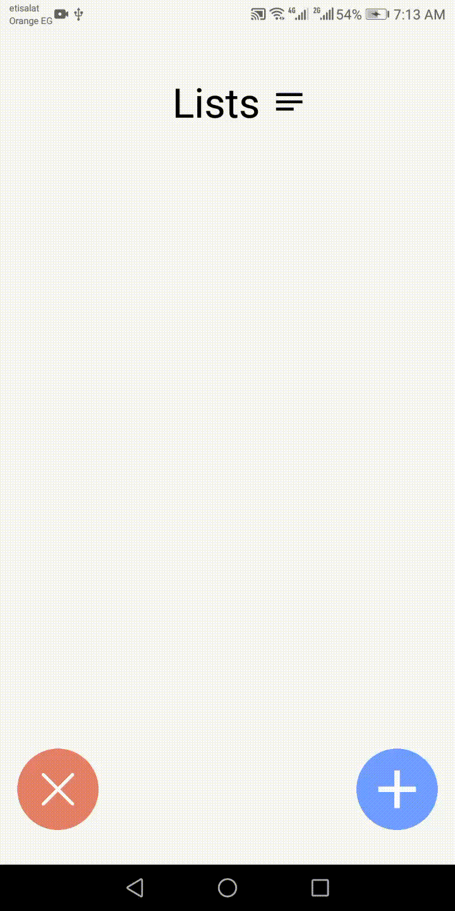

# todolist app

> a react native todo app using realm database

 

 
##  to run this app on your phone.
 - Download the code to your pc.
 - Open the project folder in your editor.
 - Run the terminal and run this command `npm install` in the project's folder.
 - connect your phone to your pc or it's ok if you are using a virtual device
 - After the installation of all dependencies run `react-native run-android`
 - this will build the app and you can see the app running
